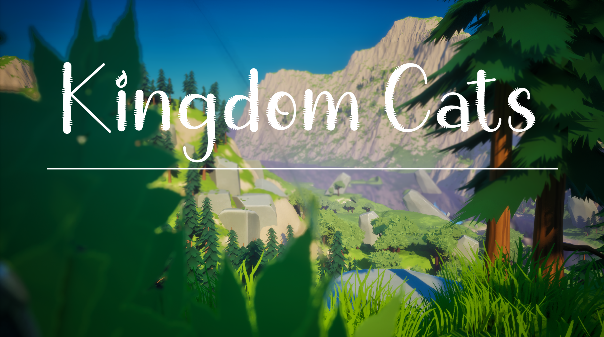

# FA24-SurberC

**Class**: CS/IDEA310H (Mixed Reality Design) \
**Assignment**: Homework Assignment 1 Handout \
**Year**: Spring 2024 \
**Members**: Christine Surber

---

---

# Table of Contents

- [FA24-SurberC](#fa24-surberc)
- [Table of Contents](#table-of-contents)
- [ Abstract](#-abstract)
- [ Resources](#-resources)
  - [ YouTube Videos](#-youtube-videos)
  - [ ChatGPT](#-chatgpt)
  - [ Outside Assets](#-outside-assets)
  - [ Unreal Engine Assets](#-unreal-engine-assets)
  - [ Game Design Guides](#-game-design-guides)
- [ Game Mechanics - How It Works](#-game-mechanics---how-it-works)
  - [ Game RunThrough](#-game-runthrough)
  - [ How Each Asset Works](#-how-each-asset-works)
- [ Development Process](#-development-process)
- [ Challenges \& Solutions](#-challenges--solutions)
- [ Conclusion](#-conclusion)

#  Abstract

The assignment tasked all students to create a FPS game in Unreal Engine, in less than a month.  The Goal was to create a game from scratch (while still able to use outside assets and templates) to fill all the required features.  The game needed to have:

* 3 Unique levels
  * Main Menu
  * Level 1
  * Level 2
* 3 Targets
* 3 Hazards
* Health Variable
* Weapon Variable
* Ammo Variable

This document will describe all the parts and details that it took to build the game and what went into it.  Everything from the resources, how the game works, to the assets used to build the game.

#  Resources

1. YouTube Videos
2. ChatGPT
3. Class Lab Videos
4. Previous Projects
5. Outside Assets
6. Unreal Engine Assets
7. FAB (UE Marketplace)
8. Game Design Guides

##  YouTube Videos

**UI Design**

* [Make A Professional MainMenu And A Settings Menu In Unreal Engine 5](https://www.youtube.com/watch?v=NOEM8mVk2r0&t=1s)
* [How to Make a Simple Loading Screen In Unreal Engine 5](https://www.youtube.com/watch?v=_QIVJu4o2IM&t=262s)
* [How to Change Levels with Fading In Unreal Engine 5](https://www.youtube.com/watch?v=en0Z7zYeAn0)
* [Unreal Player Death Tutorial (Widgets and Blueprints)](https://www.youtube.com/watch?v=dECv-SyTN2k)

**Player Data**

* [Unreal Engine 5 - Fast and smooth Sprint &amp; Crouch implementation](https://www.youtube.com/watch?v=ENksMjF068c)
* [How to Delete Skeletal Mesh Sections and Remove Bones in Unreal Engine 5.4](https://www.youtube.com/watch?v=fd8gCi7GnQE)
* [Retarget Animations FAST In 5.4 | Unreal Engine 5.4 Tutorial](https://www.youtube.com/watch?v=EvUGgpSUxPI)
* [How To Build an Enemy Health and Damage System in Unreal Engine](https://www.youtube.com/watch?v=uI5ps5DbFgI)
* [Kill All The Enemies To Win or Open A Door - Unreal Engine 4 Tutorial](https://www.youtube.com/watch?v=jXnRNLYyfxA)

**Setting up TRUE FPS**

* [How To Set Up The Ultimate... Ultimate True First Person Camera - Unreal Engine 5 Tutorial](https://www.youtube.com/watch?v=fnk4snQyWVY)
* [How to hide the head when using a true FPS character in UE5](https://www.youtube.com/watch?v=fmBZwBPScmE)
* [How to Fix Camera Clipping Through Head in Unreal Engine 5](https://www.youtube.com/watch?v=uBvMX3tySkg)
* [Unreal Engine 5 Tutorials: Learn Cameras and Animation](https://www.youtube.com/watch?v=FXyr7qrTTs0&t=99s)
* [How To Make A True First Person Camera In Exactly 1 Minute! | UE5 &amp; UE4](https://www.youtube.com/watch?v=jkPxVScULh4)

**Weapons System**

* [How To Create A Weapons System (2.0) - Unreal Engine 5 Tutorial](https://www.youtube.com/watch?v=H_Q57Yso9mM)
* [How To Set Up Semi Auto, Full Auto, and Burst Fire Modes - Unreal Engine 5 Tutorial](https://www.youtube.com/watch?v=_Fz4xNMrZog)
* [First Person Series Playlist on creating an FPS game](https://www.youtube.com/playlist?list=PLqYiINMEwk5syuLTyTqiMExgMP_v_CFAq)

**Other**

* [How to create custom thumbnails | Tips &amp; Tricks | Unreal Engine](https://www.youtube.com/watch?v=WUk23RD-icI)
* [How to Easily Use the NEW Enhanced Input Action System in Unreal Engine 5.1](https://www.youtube.com/watch?v=CYiHNbAIp4s)
* [How To Use Custom Fonts In Unreal Engine 5 (Tutorial)](https://www.youtube.com/watch?v=dP1ouCCS758)

##  ChatGPT

I would often go to ChatGPT for:

* Explanations on how to do something
* Explanations on what my errors mean in Unreal Engine
* Finding videos on how to do something
* Processes on how to perform a task in Unreal Engine

Majority of the time I would give it a task and then ask it to find YouTube videos on that task for me.  It saved me some time video searching and just gave me some options.  It didn't always give me what I wanted, but it did help me in the long run.  I'm not always able to understand information by just reading so I decided to ask it to find me videos so I could better understand and have a visual (I'm a visual learner).

##  Outside Assets

* [Virtus Hub](https://virtushub.com/courses/fps/lectures/38650002)
* [Font - Chic Cat](https://www.fontspace.com/chic-cat-font-f66041)

I didn't use many outside resources except transferring things from blender to Unreal Engine using .FBX files .... of which I didn't end up using because I ran out of time!  I thought I could import cat related items since I named my game "*Kingdom Cats*" and I wanted it to be cat related... but unfortunately since I ran out of time I wasn't able to do this so that time was kind of wasted, but at least now I know.

##  Unreal Engine Assets

I used quite a few UE assets to build my game.  I got confused at one point because I didn't realize that Epic Games had updated their marketplace policy and now worked with FAB.  So I kept trying to find assets on the actual Epic Games software not realizing I needed to go to the FAB store.  Once I realized the issue I was able to find assets easier.

I have some assets in my game project that I thought I was going to use but didn't end up using so I will just list the ones that I for sure used in the game.  In my game project I added a color to pretty much all the asset folders that I used.  It helped keep me organized, plus color helps my ADHD a lot.

Assets I Used:

**UI Design**

* [Stylized Nature Pack](https://www.fab.com/listings/b066de06-73b8-4fbe-b30c-468f5bcf7575)
* [Virtus Learning HUB](https://virtushub.com/courses/fps/lectures/38650002)

**Player Data**

* [Animation Starter Pack](https://www.fab.com/listings/98ff449d-79db-4f54-9303-75486c4fb9d9)
* ThirdPerson (Unreal Engine Starter Folder)
* Characters (Unreal Engine Starter Folder - comes with ThirdPerson Addon)

**Weapons System**

* [Military Weapons Silver](https://www.fab.com/listings/bd57e22f-f930-47a4-887d-6afc3395fae1) (Link Says it doesn't exist)
* [Virtus Learning HUB](https://virtushub.com/courses/fps/lectures/38650002)

**Level Design**

* Level 0 - Main Menu - [Stylized Nature Pack](https://www.fab.com/listings/b066de06-73b8-4fbe-b30c-468f5bcf7575) Map - "*Stylized_Nature_ExampleScene*"
* Level 1- ThirdPersonMap (Comes with Default UE ThirdPersonFolder)
* Level 2 - New Basic Level - With Assets from [Stylized Nature Pack](https://www.fab.com/listings/b066de06-73b8-4fbe-b30c-468f5bcf7575)

##  Game Design Guides

* [Most common keyboard/mouse inputs for PC games?](https://discussions.unity.com/t/most-common-keyboard-mouse-inputs-for-pc-games/613256)

I had a lot more ideas for level design in the beginning when I so naively thought I had more time that I actually did.  Once I realized ... or more accurately ... came back to reality in what it takes to make a game then my ideas went out the window and more towards functionality.  It hurt my artist heart, but it had to be done.

#  Game Mechanics - How It Works

And now for the detailed part of how the game works...

##  Game RunThrough

**Level 0 - Main Menu**

The Level begins with a simple menu screen with buttons for: Start, Settings, Credits (Not Currently Available), and Quit.  All buttons work except the Credits button.  The settings button brings the player to a settings page with resolution rate, difficulty (not currently available), gama, and player name.  The quality actually does work.  There is also a back button to go back to the main menu.  When the player presses the New Game button the screen transitions into black and then a loading screen that goes for 7 seconds then it opens the first level.

**Level 1 - Level 01**

Level 1 begins with the player starting in the ThirdPersonMap with 3 enemies and 4 different types of damage targets.  The enemies are just headless people with a health bar above their body.  There are 3 different weapons to choose from (pistol, shotgun, assault rifle).  The player must shoot the enemies until their health is 0 where they will fall to the ground and the enemies hit target will increment.  There are 3 fire zones and a big red ball ... aka the Ball of Death ... it will literally instant kill you if you run into it.  I was playing around with different settings and decided to leave it in the game, plus it looks cool!  Once all the enemies have been eliminated then the player will fall over as if passing out and the next level will load up with the transition effect from the start button on the main menu.

**Level 2 - Level 02**

Level 2 begins with the player starting in a blank basic world with rocks, trees, enemies and targets.  There are 4 enemies in this level and all spread out across the level.  The player must find a weapon, or find all 3 and then kill all the enemies to win!  Once all enemies have been eliminated then the player will pass out once again and the YouWin scene will pop up.  The player can choose to quit or go back to the menu.

##  How Each Asset Works

**Player Character**

The player character is based on the Mannequin Quinn (Child of Manny).  I know the assignment said to use the First Person Template but I decided to use the Third Person Template to create a TRUE FPS character.  Instead of just having arms, the player now has a whole body, except for the head.  There was a clipping through glitch so I had to remove the head in order to keep this from happening.  The viewpoint is still an FPS design, just using a different template.  To me it feels more personal to have a body instead of just arms.  I relate to this as my experience with full body tracking in VR.  The experience is much more immersive when you have move all of you instead of just one part of you.  The player can move around with the keyboard and mouse - everything from simple movements of forwards, backwards, left, right, to sprinting.  I had crouching made but something went wrong and I couldn't find the issue so I decided to move on without it.  Same with the aim function; I didn't really set it up correctly.

**Enemy Character**

The enemy character is based on the Mannequin Manny.  Because I used the same asset as what I was using for my character the head was missing.  I figured it fit with the idea that it's an enemy.  I didn't have time to fix my issue so I just left it as it is.  I wasn't able to configure an AI character that follows the character so I left them as solitary.  They do have a death animation, but that's it.  Just like the Player Character they have a health bar that starts at 100.  Every time they are damaged their health goes down!  Once their health reaches 0 then they will die and add to the enemies eliminated count.

**Damage Objects**

I made 2 different damage objects.  One is a fire box that floats in the air.  I was going to make it a barrel but decided that floating fire looked better and had more of a mystical look to it.  It's floating in the air and a little on the subtle side which makes it easier for the player to run into them (even though they're very easy to avoid).  The second damage is called "INSTANTKILL".  I play Call of Duty with my boyfriend sometimes and we have a blast!  I got the inspiration for this from COD.  Though I reversed it in my game.  Instead of getting an instant kill to kill all the zombies, this is a ball of laser design that if you run into it will automatically kill the player!  I wish I could have added the "INSTANT KILL" voiceover to the ball but didn't have time.  It would have been a fun reference to COD, one of my favorite FPS games.

**Pickups**

I made 5 different pickups: Health, Ammo, Shotgun, Pistol, Assault Rifle.

The Health Pickup is pretty self-explanatory.  You overlap with the object and you will gain health then the object will be destroyed.  The Ammo Pickup works about the same way as the Health Pickup.  You overlap the object and you will gain ammo, then the object will be destroyed.

The Weapon Pickups all derive from a PickupMaster class to make coding each weapon easier.  Each weapon is connected to it's own separate Weapon BluePrint that allows me to properly code the specifications of each gun.  The ammo is world based instead of weapon based because I didn't have time to code individual ammo per gun.  I made it easier by setting all ammo to work with all the weapons in the game.  When the weapons shoot you lose one ammo.  I have it set in the code that each time the gun projects a trace line that acts as a bullet which connects to the ammo.  The animations for each gun is slightly different, but isn't very aligned so the shots are a little funky.  The shotgun is the worst, but it does still shoot targets.

**User Interface**

Once I figured out how to make UIs it became a very quick task for me.  Just alight and ancor specific details so it will be displayed on the screen correctly.  I made: Loading Screen, Transition (Fade to Black), You Died Menu, You Win Menu, Settings Menu, Main Menu, Player HUD, and a UI Title Screen.  The title screen didn't really make it's way into the final product of the game, but it exists.

Each interface utilizes the Chic Cat font, except the Player HUD.  I thought a regular font would look better and the player would be able to read it better.  All the buttons are bound to specific actions or variables within the game.  The animations were pretty much the same over all of them so it was just copy and past for many of them.  I added a few extra details like the loading screen because I felt like it added a sense of design and function to the game.  Instead of just pressing a button and instantly going somewhere else it has some pizaz that adds to the design.  It makes the game seem more clean than it actually is.  I am a designer at heart so anything I can do to add to the appeal aspects I will.

**Maps**

Each map has it's own design with similar assets in each part.  The maps themselves are very simple, but the process of beating each level is the same.  I'm most proud of the main menu design because I feel like it has a professional touch to it.  Again... the design aspect to make the game appear nicer than it is.  Since I wasn't able to make the maps look as nice and detailed as I wanted to I put some of that energy in other places.

#  Development Process

In terms of development ... ... ... It was much slower in the beginning that I would have liked.  I'd never made a game before and I'd only worked with Blender, some Unity, and the rest was on my IPad.  This was my first time working with Unreal Engine so the entire process was a learning train for me.  I needed to learn how to understand blueprints, adding assets, what it takes to connect specific parts of the game to other parts, and so on.  I spent too much time in the beginning working on the design and visual appeal instead of the game function.  I was so used to the visual appeal being the most important that I didn't realize that I was setting myself up for failure.  By the time I realized what I needed to do and why I was struggling so much it was already too close to the due date.  I finally realized ... about 5 days before the due date what I needed to do and shift my attention to the actual game function.  So I finished my other classes projects as quick as possible so I could focus all my attention on the game.

Development took a while, but once I started to understand the connections and take some of my knowledge of coding and put it into blueprints (which I actually like better) then I was able to have an easier time coming up with solutions to my struggles and functions.  Most of the work came from YouTube videos but after watching so many videos I was slowly developing a better understanding for how everything worked.

#  Challenges & Solutions

During my time in developing the game I came across quite a few issues:

* Spending too much time on visual appeal
* Learning to understand more than I needed to at the time (EVERYTHING)
* Ammo Function
* Setting up Weapons Correctly
* Health System
* Trying to make Zinx (Paragon Character from UE Marketplace) my main character
* Re-Creating new projects out of frustration (Starting from scratch)
* Putting More than I can Chew in my mouth

All of this added to my challenge of why it was taking me so long to finish the game in the time given.  In the end I had to stop adding to the visual appeal because I was hurting my time to work on the game function.  I decided to just use what I had already made and not do more than that unless I finish before the due date and had more time to add to it (of which I didn't).  I spent a lot of time setting up different weapons when I should have just done one.  I wanted to be an overachiever and have multiple so I spent lots of time watching YouTube videos to create a fully functioning weapons system with semi and auto firing weapons.  In the end I was finally able to make them work but saved time by making the ammo system world based instead of individual weapon based.

In terms of the Zinx character, I spent so much time trying to make her the main character but kept running into different walls.  I wanted her to be the main character because of her cat aspects.  Since  I wanted my game to be cat based I thought that this was perfect but ended up wasting way too much time on something that I shouldn't have been doing in the beginning.  I fixed the issue by giving up on her as a main character and using the mannequin characters instead since they were already easy to implement in the game system.

Re-Creating New Projects ... I did this at least 7 different times because I kept getting frustrated with what I was making, something stopped working, I added too many assets and overloaded the project, got so frustrated that nothing was working I thought I could save time by starting new ... the list goes on.  This was definitely a time eater for me and it took me a while to finally settle down on a project.  Once I did I stayed on it and almost made a new project but didn't so I was able to actually progress farther into the game than I was beforehand.  Part of my issue was not taking enough breaks so instead of walking away I would just get frustrated!  It was easy to migrate files between projects but starting fresh just made things worse.  It worked as just testing small parts but in terms of the whole project it didn't.

The last biggest issue I had was the health and ammo system.  For the longest time I could not figure out an easy and simple way to setup these variables to be connected to the weapons and the player.  I kept trying to find videos but just about all of them were more detailed than I wanted or needed.  After lots of testing I was finally able to get the health variable to work with damage from damage boxes.  The ammo was resolved by asking ChatGPT a simple way to connect ammo to the gun.  It suggested connecting it to the line trace, which I did, and it worked!  Once I got all of those setup the last part was setting up the transition between levels (when all enemies are killed) then I was done.

#  Conclusion

In Conclusion, this project was really fun and the death of me.  It has definitely destroyed my back from sitting at my desk all day.  I had many times of working for 8 hours straight and working until 1 or 2 am in the morning.  I know that's generally normal for college, but I try to keep to a consistent schedule that doesn't involve working on homework past 11:00pm.

Because of everything that happened and all the time that I had wasted I technically made this game in less than a week.  That's pretty good, but very stressful.  The time constraint was the most stressful part of the game.  Actually putting the game together and problem solving was fun and interesting for me.  Blueprints are a lot more fun than actually coding in my opinion.

No matter what I'm still proud of all that came of the game.  It helps that my mom and boyfriend are constantly telling me that no matter what it will turn out amazing.  All my hard work will pay off and it will be amazing no matter how good or bad it turns out.  I wish I could have added more to it in terms of functionality but there was only so much that I could do in the time I was given so I have slowly made peace with that fact.  It just means that I've learned this time so I can do a better job for the next project.
